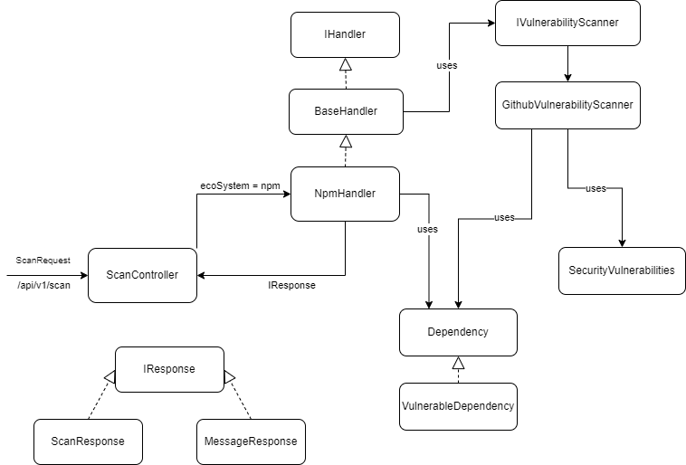

# PackageShield

Scan your packages for any vulnerability!

## System Design



## Getting Started

These instructions will cover usage information and for the docker container

### Prerequisities

In order to run this container you'll need docker installed.
See the [Docker website](http://www.docker.io/gettingstarted/#h_installation) for installation instructions.

## Usage

Run using docker with the following command:

```shell
docker run --name packageshield -d -p 8080:8080 amielr/packageshield:latest
```

Once everything has started up, you should be able to access the API via [http://localhost:8080/api/v1/scan](http://localhost:8080/api/v1/scan) on your host machine and start sending scan requests.

```shell
open http://localhost:8080/api/v1/scan
```

#### Environment Variables

- `GITHUB_ACCESS_KEY` - The GitHub Access Key injected into the container during build process.

## Build

If you wish to create a new docker image, follow the steps below:

1.  Clone this repo

        git clone https://github.com/AmielRe/PackageShield.git

2.  Manually download Java 20.0.1 from the Oracle site and configure JAVA_HOME environment variable

3.  Manually download gradle 8.1.1 and configure it accordingly

4.  Build the project using gradle

        cd PackageShield
        gradlew build

    This might take a few seconds to complete.

5.  Build the image (replace `#YOUR_ACCESS_TOKEN#` with your real access token - can be generated on [GitHub Access Token](https://github.com/settings/tokens)).

        cd src/main/docker
        docker build --build-arg GITHUB_ACCESS_TOKEN=#YOUR_ACCESS_TOKEN# -t packageshield .

    This will take a few seconds.

6.  Run the image using the following command, which should start everything up. The `-p` option forwards the container's port 8080 to port 8080 on the host.

        docker run --name packageshield -d -p 8080:8080 packageshield:latest

7.  Once everything has started up, you should be able to access the API via [http://localhost:8080/api/v1/scan](http://localhost:8080/api/v1/scan) on your host machine and start sending scan requests.

        open http://localhost:8080/api/v1/scan

## Authors

- **Amiel Refaeli** - [Github](https://github.com/AmielRe)
